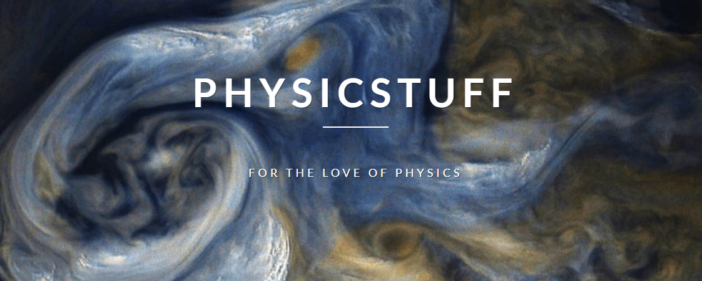

# PhysicStuff

Hi there,  

The motivation to create this is to help visualise physics concepts using Python. Also this is a counterpart of my main blog http://physicstuff.com/ where I try to explain concepts.  
Here's the [latest post](http://physicstuff.com/what-is-leidenfrost-effect/)  

Now the plan is to provide the code too for the plots I use in the blog. I'll keep updating the repo as I try new things.

This serves my selfish purpose of practicing python. But it's always fun to write codes which can visualise functions, plot, fit, and analysis of what things actually mean. 
Feel free to play around with the code and if you could make it better raise an issue I'll look into it.   

Cheers!

Note: If some notebook cannot be opened in GitHub then just copy the url and view it on https://nbviewer.jupyter.org/ 

